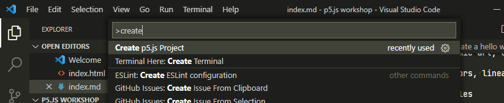
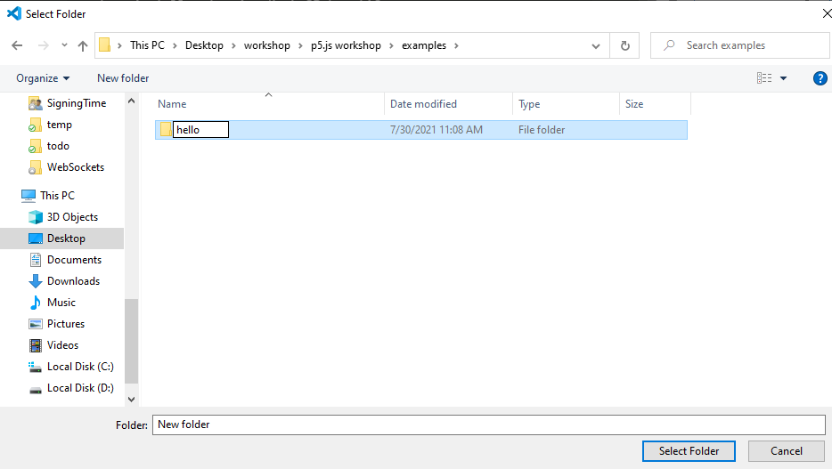
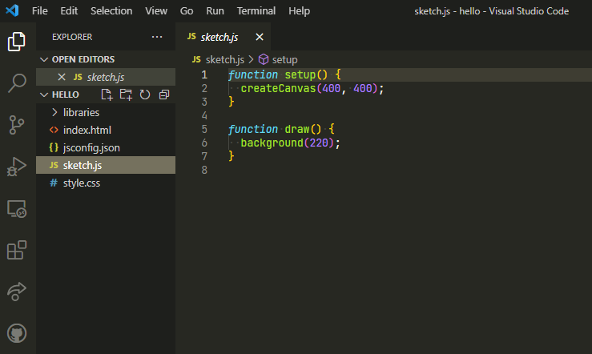
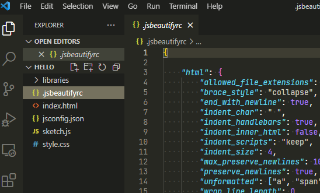
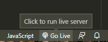
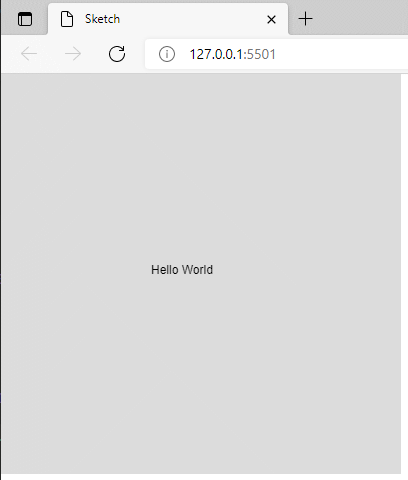

# Day 1

## Introduction to Programming with P5.js

### Get setup!

We will use Visual Studio Code to write our programs. Checkout [Getting Started with Visual Studio Code](https://code.visualstudio.com/docs/introvideos/basics)

Plugins you should install to code for the course:

```
code --install-extension christian-kohler.path-intellisense
code --install-extension HookyQR.beautify
code --install-extension ms-toolsai.jupyter
code --install-extension ms-vsliveshare.vsliveshare
code --install-extension msjsdiag.debugger-for-chrome
code --install-extension ritwickdey.LiveServer
code --install-extension samplavigne.p5-vscode
code --install-extension streetsidesoftware.code-spell-checker
code --install-extension VisualStudioExptTeam.vscodeintellicode
```
[How to use p5.js with Visual Studio Code](https://youtu.be/vj9nDja8ZdQ)

I recommend that you download and extrcat the following [`jsbeautifyrc.zip`](assets/jsbeautifyrc.zip) file. The `.jsbeautifyrc` file is a configuration file to customize your format style of javascript, html and CSS files. This can be used by the Beautify plugin for VSCode. Simply place this file in the root of your project folder. [Documentation is here](https://github.com/HookyQR/VSCodeBeautify/blob/master/Settings.md) if you'd like to customize it.


### Create a hello world sketch

- Open up Visual Studio Code
- Create a p5.js Project
    - Ctrl+Shift+P
    - Type the word `create`
    - Click on `Create p5.js Project` from the dropdown 
        
    - Create and name a folder for your project 
        
    - Your project should lke like this 
        
    - **_Optional Step_** - Download and extract the [`jsbeautifyrc.zip`](assets/jsbeautifyrc.zip) to your project folder 
        
- Edit the `sketch.js` file to contain the following :

```javascript
function setup()
{
    createCanvas( 400, 400 );
}

function draw()
{
    background( 220 );

    text("Hello World", 150, 200);
}
```
- Click on the Go Live button located on the bottom right of editor. 
    
- You should now see the sketch running in your local web browser
    

Checkout this [live example](examples/hello/index.html).

<!-- ## Shapes & Drawings -->

<!-- ## Color -->
<!-- ## Debugging -->
<!-- ## Variables -->
<!-- ## Javascript Objects -->
<!-- ## Mapping range values -->
<!-- ## Random -->
