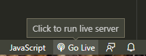
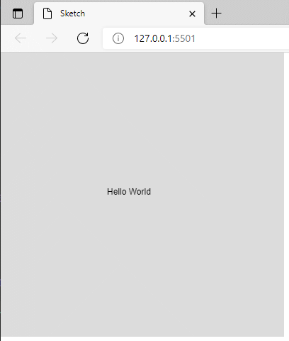

# p5.js Workshop

Welcome to the workshop! This week we will learn how to program with the popular javascript library [**p5.js**](https://p5js.org/ko/). It enables us to easily do creative coding!

We will launch into the world of writing code through the process of programming video games! The emphasis in this workshop is on learning the foundational programming concepts, including variables, conditional statements, and loops, that form the basis of game logic. Students are also exposed to concepts in physics, graphics, and audio libraries while programming the logic for a series of games.

## Learning Outcomes

* Javascript coding basics such as variables, conditionals, iterations, functions and classes
* Basic video game programming concepts, including algorithmic art, character behaviors, sound effects, music, and processing user input
* Game development math such as 2D coordinate systems, vectors, linear equations, and quadratics
* Physics topics such as gravity and forces to model particles

# Day 1

## Introduction to Programming with P5.js

### Get setup!

We will use Visual Studio Code to write our programs. Checkout [Getting Started with Visual Studio Code](https://code.visualstudio.com/docs/introvideos/basics)

Plugins you should install to code for the course:

```
code --install-extension christian-kohler.path-intellisense
code --install-extension HookyQR.beautify
code --install-extension ms-toolsai.jupyter
code --install-extension ms-vsliveshare.vsliveshare
code --install-extension msjsdiag.debugger-for-chrome
code --install-extension ritwickdey.LiveServer
code --install-extension samplavigne.p5-vscode
code --install-extension streetsidesoftware.code-spell-checker
code --install-extension VisualStudioExptTeam.vscodeintellicode
```
[How to use p5.js with Visual Studio Code](https://youtu.be/vj9nDja8ZdQ)

I recommend that you download and extrcat the following [`jsbeautifyrc.zip`](assets/jsbeautifyrc.zip) file. The `.jsbeautifyrc` file is a configuration file to customize your format style of javascript, html and CSS files. This can be used by the Beautify plugin for VSCode. Simply place this file in the root of your project folder. [Documentation is here](https://github.com/HookyQR/VSCodeBeautify/blob/master/Settings.md) if you'd like to customize it.


### Create a hello world sketch

1. Open up Visual Studio Code
2. Create a p5.js Project
    - Ctrl+Shift+P
    - Type the word `create`
    - Click on `Create p5.js Project` from the dropdown 
        
    - Create and name a folder for your project 
        
    - Your project should lke like this 
        
    - **_Optional Step_** - Download and extract the [`jsbeautifyrc.zip`](assets/jsbeautifyrc.zip) to your project folder 
        
3. Edit the `sketch.js` file to contain the following :
```javascript
function setup()
{
    createCanvas( 400, 400 );
}

function draw()
{
    background( 220 );

    text("Hello World", 150, 200);
}
```
4. Click on the Go Live button located on the bottom right of editor. 
    
5. You should now see the sketch running in your local web browser
    

## Shapes & Drawings

<!--## Color
## Debugging
## Variables
## Javascript Objects
## Mapping range values
## Random

# Day 2

## Conditional Statements
## How to bounce a ball
## Loops
## Functions
## Object Orientated Programming with Classes

# Day 3

## Creating Bigger Projects
## Arrays
## Mouse interactions
## Image Media
## Sound Media
## Arcade game project

# Day 4

## Pitch Your Game Idea!

# Day 5

## Show off your Game! -->
